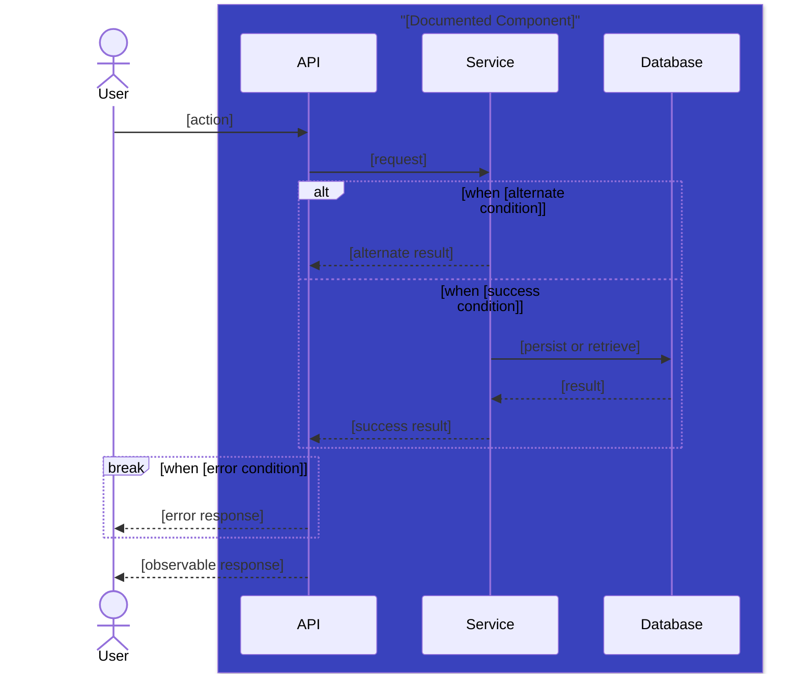

## Goal and Actors

State the goal, primary actor, supporting actors, documented components, and product outcome. Actors may be referenced directly. API, service, database, and other component-like participants must map to a documented component.

## Preconditions and Trigger

Describe required state and initiating event.

## Main Success Scenario

1. Actor [action].
2. Product [observable response].
3. Documented component [interaction or result].

## Sequence Diagram

Every use case must include a Mermaid sequence diagram showing actors and documented components. API, service, database, and other internal participants may be used only inside a `box` named after their owning component and with a rgb color defined. Include alternate and error paths in the diagram using Mermaid control-flow constructs.

Do not add a separate alternate or error scenario section. Express permissions, invalid input, unavailable dependencies, retries, recovery, and boundary cases in the sequence diagram using `alt`, `else`, `break`, `opt`, or `loop`.

## Postconditions

State resulting state, notifications, events, and measurable outcome.

## Traceability

Link features, user stories, rules, documented components, APIs, events, and ontology terms. Every component-like participant in the diagram must be traceable to a linked component document.
