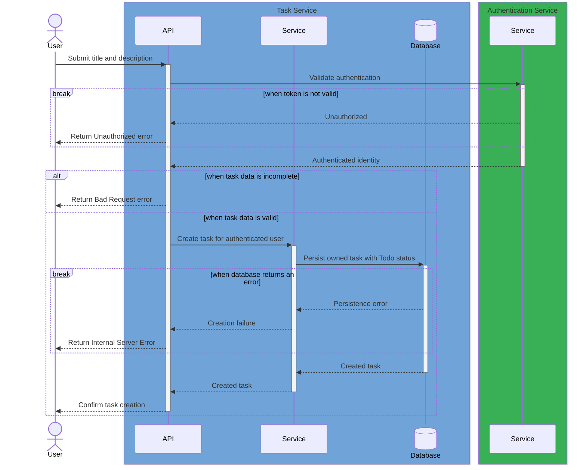

## Goal and Actors

The task user records new work. The participating components are the [authentication service](/examples/todo-list/specs/components/auth-service/component.md) and [task service](/examples/todo-list/specs/components/task-service/component.md). Internal API, service, and database participants are grouped inside their owning component boxes.

## Preconditions and Trigger

The user is authenticated and submits a non-blank task title.

## Main Success Scenario

1. User submits task data.
2. Task service validates identity and input through the authentication service.
3. Task service creates an owned task with `Todo` status.
4. Product confirms the created task.

## Sequence Diagram

## Postconditions

One accessible task exists with the authenticated user as owner and `Todo` status.

## Traceability

Feature: [Create tasks](/examples/todo-list/specs/features/task-management/create-tasks/feature.md). Rules: [Task management rules](/examples/todo-list/specs/features/task-management/rules.md).
